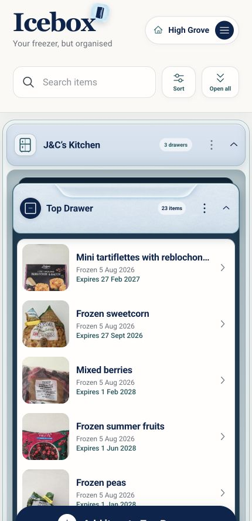

# Icebox

Icebox is an installable household freezer-inventory app for desktop, iPhone, and Android, with the primary user being my father-in-law. 



## What it does

- Organises food by household, freezer, and drawer.
- Searches and sorts labels, dates, and expiry information.
- Stores private photos and can suggest an editable label with OpenAI.
- Shares a household with invited ChatGPT users.
- Installs as a PWA and works read-only when temporarily offline.
- Mirrors inventory records to a private operator-owned Google Sheet for disaster recovery.

## Technology

Icebox is a TypeScript and React PWA. Its Worker uses D1 as the source of truth, private R2 storage for images and thumbnails, the OpenAI Responses API for label suggestions, and the Google Sheets API for the recovery mirror. Authentication is supplied by Sign in with ChatGPT flow.

## Local development

```sh
npm ci
cp .env.example .env
npm run dev:local
```

Never put real credentials in source control. `.env`, local databases, uploaded media, build output, and dependencies are ignored; only documented placeholders belong in `.env.example`.

## Verification

```sh
npm test
npm run build
```

The full suite covers unit logic, Sites packaging, the local Worker and migrations, authentication, and browser-level PWA behavior. `npm run build` also checks the protected runtime before packaging the Sites deployment.

## Source and releases

`main` is the canonical source of truth for production. Releases use Semantic Versioning, annotated Git tags such as `v2.1.0`, and matching GitHub Releases. The Sites-managed Git remote is deployment transport, not the source repository.

Production publication is a separate, explicitly approved step: a GitHub release does not itself deploy the app. See [Operations](docs/OPERATIONS.md) for environment setup, backup reconciliation, recovery, and release safeguards.
